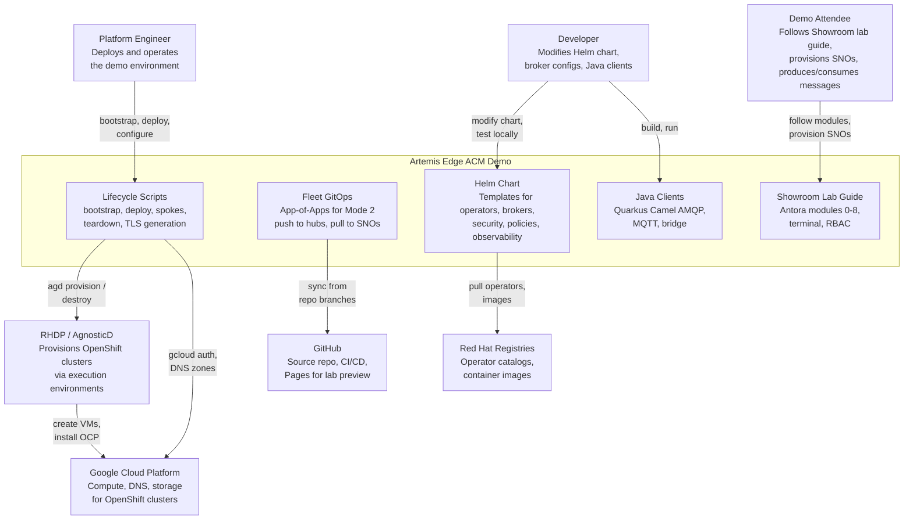

# System Context Diagram

The Artemis Edge ACM Demo is a Helm-based platform that deploys federated
AMQ Broker messaging across RHACM-managed Single Node OpenShift (SNO) edge
clusters. Three actor types interact with the system. External services
provide infrastructure, container images, and cluster provisioning.

## Legend

| Element | Description |
|---------|-------------|
| **Platform Engineer** | Runs `bootstrap.sh` and `deploy.sh` to provision clusters and deploy workloads. |
| **Developer** | Edits Helm templates, values overlays, fleet-gitops configs, or Java clients. |
| **Demo Attendee** | Uses Showroom to walk through modules, provision SNO spokes, and test messaging. |
| **Helm Chart** | Single chart at repo root. Deploys operators, brokers, Keycloak, ACM policies, and observability. |
| **Fleet GitOps** | Mode 2 only. Argo CD Application that pushes config to regional hubs and pulls AMQ to SNOs. |
| **Showroom** | Antora lab guide with terminal access. Deployed on a hub cluster. |
| **RHDP / AgnosticD** | Red Hat Demo Platform provisioner. Creates OpenShift clusters on GCP. |
| **GCP** | Google Cloud Platform. Hosts all clusters in this demo. |
| **Red Hat Registries** | `registry.redhat.io` and `redhat-operators` catalog. Supplies operator bundles and images. |
| **GitHub** | Hosts the source repo, runs Helm lint CI, and publishes the Antora static preview. |
