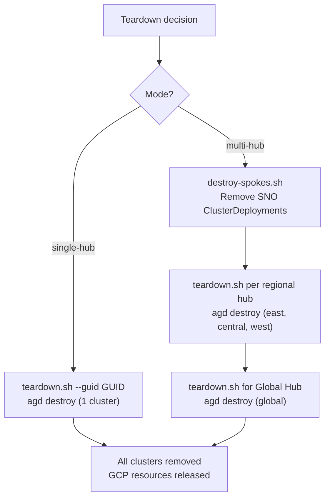

# Deployment Lifecycle

This flowchart shows the full lifecycle from initial setup through
cluster provisioning, spoke creation, and teardown. Decision nodes
distinguish Mode 1 (single-hub) from Mode 2 (hub-of-hubs).

## Provisioning Flow

```mermaid
flowchart TD
    Start["Clone repo +
    drop gcp-key.json"]

    Bootstrap["bootstrap.sh
    Auto-detect sandbox ID,
    install prerequisites"]

    OnboardYml["Read onboard.yml
    Single source of truth
    for setup steps"]

    AutoDetect{"gcp-key.json
    found?"}

    ManualConfig["Prompt for GUID,
    domain, key path"]

    AutoConfig["Extract sandbox ID,
    pre-fill config"]

    AgdSetup["Clone agnosticd-v2,
    run agd setup,
    scaffold secrets"]

    TLS["generate-tls.sh
    Broker + Keycloak
    TLS certificates"]

    Validate["Validate environment
    Check tools, secrets,
    GCP credentials"]

    ModeDecision{"global.mode?"}

    Mode1Deploy["deploy.sh
    agd provision (1 cluster)
    single ACM hub"]

    Mode2Global["deploy.sh --mode multi-hub --tier global
    agd provision (Global Hub)
    values-mode2-global.yaml"]

    Mode2East["deploy.sh --tier east
    agd provision (East hub)
    values-mode2.yaml"]

    Mode2Central["deploy.sh --tier central
    agd provision (Central hub)
    values-mode2.yaml"]

    Mode2West["deploy.sh --tier west
    agd provision (West hub)
    values-mode2.yaml"]

    PostProvision["post-provision-multihub.sh
    Fix cert-manager zones,
    Argo syncOptions,
    import hubs to Global Hub"]

    HelmSync["Argo CD syncs Helm chart
    Sync waves 0-6:
    namespaces, operators, certs,
    brokers, Keycloak, policies"]

    SpokeProvision["Module 2: deploy-spokes.sh
    Student creates SNO edges
    via Hive ClusterDeployments"]

    SpokeImport["RHACM imports SNOs
    klusterlet, labels,
    ApplicationSet targets"]

    BrokerFederation["Site brokers federate
    outbound AMQPS to
    regional hub broker"]

    Running["Demo running
    Modules 3-8 in Showroom"]

    Start --> Bootstrap
    Bootstrap --> OnboardYml
    OnboardYml --> AutoDetect

    AutoDetect -->|"Yes"| AutoConfig
    AutoDetect -->|"No"| ManualConfig
    AutoConfig --> AgdSetup
    ManualConfig --> AgdSetup

    AgdSetup --> TLS
    TLS --> Validate
    Validate --> ModeDecision

    ModeDecision -->|"single-hub"| Mode1Deploy
    ModeDecision -->|"multi-hub"| Mode2Global

    Mode1Deploy --> HelmSync

    Mode2Global --> Mode2East
    Mode2East --> Mode2Central
    Mode2Central --> Mode2West
    Mode2West --> PostProvision
    PostProvision --> HelmSync

    HelmSync --> SpokeProvision
    SpokeProvision --> SpokeImport
    SpokeImport --> BrokerFederation
    BrokerFederation --> Running
```

## Teardown Flow

## Script Reference

| Script | Purpose |
|--------|---------|
| `bootstrap.sh` | One-command setup. Reads `onboard.yml`, installs tools, scaffolds secrets, deploys. |
| `scripts/deploy.sh` | Main provisioner. Wraps `agd provision`. Supports `--mode`, `--tier`, `--destroy`. |
| `scripts/deploy-spokes.sh` | Module 2. Creates SNO edge clusters via Hive ClusterDeployments. |
| `scripts/destroy-spokes.sh` | Removes SNO ClusterDeployments (reverse of `deploy-spokes.sh`). |
| `scripts/post-provision-multihub.sh` | Mode 2 only. Fixes cert-manager, patches Argo, imports hubs. |
| `scripts/start.sh` | Start a stopped cluster. |
| `scripts/stop.sh` | Stop a running cluster (save costs). |
| `scripts/teardown.sh` | Destroy a cluster. Wraps `deploy.sh --destroy`. |
| `scripts/generate-tls.sh` | Generate TLS keystores and truststores for brokers and Keycloak. |
| `scripts/generate-secrets.sh` | Scaffold AgnosticD secrets from GCP key. |
| `scripts/validate-deployment.sh` | Post-deploy health gate. |
| `scripts/save-deployment-info.sh` | Write `deployment-info.yml` and `.md` from AgnosticD output. |
