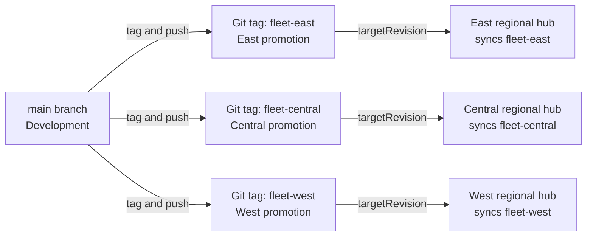

# GitOps Flow — Push and Pull (Mode 2)

Mode 2 uses a two-stage GitOps model. The Global Hub Argo CD **pushes**
configuration to three regional hubs. Each regional hub Argo CD **pulls**
AMQ workloads onto student-provisioned SNO sites. Region Git tags control
the promotion boundary.

```mermaid
sequenceDiagram
    participant Repo as GitHub Repo
    participant GHArgo as Global Hub Argo CD
    participant EastArgo as East Hub Argo CD
    participant CentralArgo as Central Hub Argo CD
    participant WestArgo as West Hub Argo CD
    participant SNO as SNO Edge Site

    Note over Repo: fleet-gitops/ directory<br/>applicationsets/hubs.yaml<br/>hubs/overlays/{east,central,west}

    rect rgb(40, 40, 60)
        Note right of Repo: Stage 1: Push (Global to Regionals)
        Repo->>GHArgo: fleet-gitops Application syncs
        GHArgo->>GHArgo: hubs.yaml ApplicationSet evaluates<br/>Placement: hub-tier=regional
        GHArgo->>EastArgo: Push hubs/overlays/east<br/>targetRevision: fleet-east tag
        GHArgo->>CentralArgo: Push hubs/overlays/central<br/>targetRevision: fleet-central tag
        GHArgo->>WestArgo: Push hubs/overlays/west<br/>targetRevision: fleet-west tag
    end

    Note over EastArgo: Each regional hub receives:<br/>- applicationset-amq.yaml (pull)<br/>- GitOpsCluster for SNOs<br/>- OperatorPolicies (AMQ, UWM)

    rect rgb(40, 60, 40)
        Note right of EastArgo: Stage 2: Pull (Regional to SNOs)
        EastArgo->>EastArgo: applicationset-amq evaluates<br/>Placement: fleet=amq
        SNO-->>EastArgo: GitOpsCluster registered<br/>(skip-reconcile annotation)
        EastArgo->>SNO: Pull amq/overlays/site-class/small<br/>ActiveMQArtemis + ServiceMonitor
    end

    Note over SNO: SNO receives:<br/>- Site AMQ broker CR<br/>- brokerProperties secret<br/>- ServiceMonitor for metrics
```

## Promotion Workflow

## Key Files

| File | Purpose |
|------|---------|
| `fleet-gitops/applicationsets/hubs.yaml` | Global Hub ApplicationSet. Targets clusters labeled `hub-tier: regional`. |
| `fleet-gitops/hubs/base/` | Base config: pull ApplicationSet, GitOpsCluster, site platform policies. |
| `fleet-gitops/hubs/overlays/{region}/` | Per-region patches. Each overlay sets `targetRevision` to the region tag. |
| `fleet-gitops/amq/base/broker.yaml` | Cookie-cutter site broker. Uses `brokerProperties` (AMQ 7.12). |
| `fleet-gitops/amq/overlays/site-class/small/` | Site-class overlay for small SNOs. |
| `fleet-gitops/platform/policies/` | OperatorPolicy sources (AMQ Broker, GitOps, UWM). |
| `fleet-gitops/platform/placements/all-hubs.yaml` | Placement for Global Hub to target managed hubs. |

## Key Points

- Push uses standard Argo CD Application sync. The Global Hub opens connections to regional hub APIs.
- Pull uses `argocd.argoproj.io/skip-reconcile` annotation. The regional hub does **not** open connections to SNO APIs. Requires OpenShift GitOps Operator 1.9.0+.
- Region tags are the promotion boundary. Move a tag forward to roll out changes to that region.
- Site brokers use `brokerProperties` secrets (not `ActiveMQArtemisAddress` or `ActiveMQArtemisSecurity`, which are deprecated in AMQ Broker 7.12).
