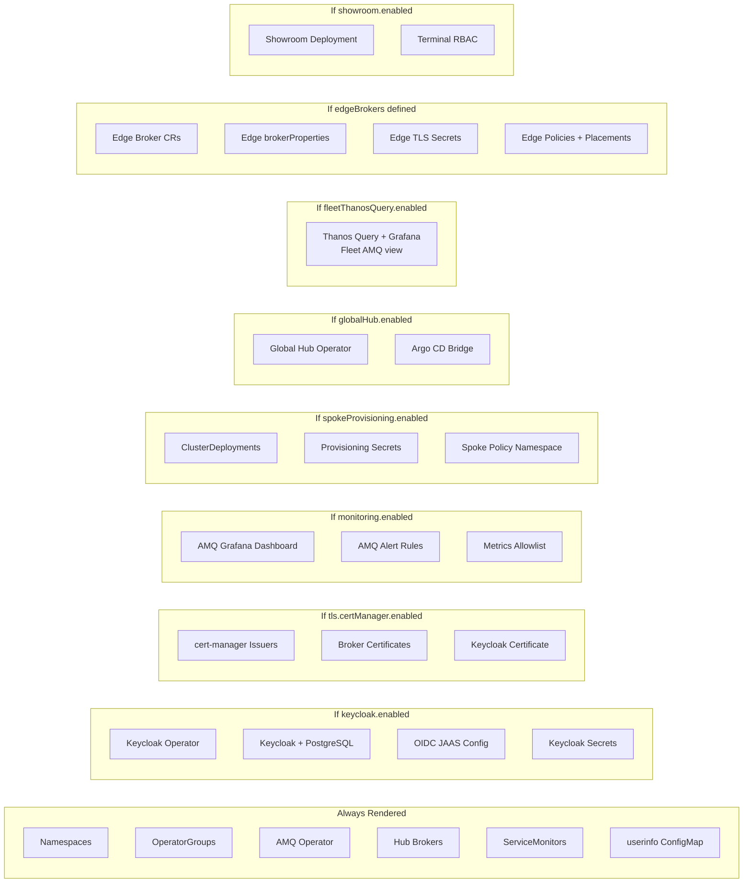

# Helm Chart Components and Sync Waves

The Helm chart at the repo root deploys all platform services. Argo CD
sync-wave annotations control the deployment order. Conditional toggles
in `values.yaml` control which components render for each deployment mode.

## Sync-Wave Ordering

```mermaid
flowchart TD
    subgraph Wave0 ["Sync Wave 0: Foundations"]
        NS["namespaces.yaml
        artemis, keycloak"]
        OG["operator-groups.yaml
        AMQ + Keycloak OGs"]
    end

    subgraph Wave1 ["Sync Wave 1: Operators + Issuers"]
        AMQOp["amq-broker-operator-sub
        AMQ Broker 7.14.x"]
        KCOp["keycloak-operator-sub
        RHBK Keycloak"]
        CertIssuer["cert-manager-issuer
        ClusterIssuers, Issuers"]
    end

    subgraph Wave2 ["Sync Wave 2: Certificates + CRD Gates"]
        BrokerCerts["cert-manager-broker-certs
        Hub + edge TLS certs"]
        WaitCRDs["wait-for-crds
        Jobs that block until
        AMQ + Keycloak CRDs exist"]
        ESOStore["external-secrets-store
        (if externalSecrets.enabled)"]
        SpokeSec["spoke-provisioning-secrets
        (if spokeProvisioning.enabled)"]
    end

    subgraph Wave3 ["Sync Wave 3: Pre-Broker Resources"]
        KCCert["cert-manager-keycloak-cert
        Keycloak TLS certificate"]
        SpokeDeploy["spoke-cluster-deployments
        Hive ClusterDeployments
        (if spoke clusters defined)"]
    end

    subgraph Wave4 ["Sync Wave 4: Core Workloads"]
        HubBroker["hub-broker.yaml
        ActiveMQArtemis hub-01
        + properties, TLS, Prometheus"]
        EdgeBroker["edge-broker.yaml
        ActiveMQArtemis per spoke
        + properties, TLS, Prometheus"]
        KC["keycloak.yaml
        Keycloak + PostgreSQL
        + realm import prep"]
    end

    subgraph Wave5 ["Sync Wave 5: Policies + Lab"]
        KCRealm["keycloak-realm-import
        OIDC realm config"]
        RBAC["workshop-user-rbac
        Student role bindings"]
        EdgePolicies["edge-broker-policies
        ACM Policies + Placements
        for edge brokers"]
        SpokePolicies["spoke-rhacm-policies
        ManagedCluster labels"]
        FleetApp["fleet-gitops-app
        (Mode 2: Global Hub only)"]
    end

    subgraph Wave6 ["Sync Wave 6: Post-Policy"]
        PlacementBindings["edge-broker-policies
        PlacementBindings
        (after Placements exist)"]
    end

    Wave0 --> Wave1
    Wave1 --> Wave2
    Wave2 --> Wave3
    Wave3 --> Wave4
    Wave4 --> Wave5
    Wave5 --> Wave6
```

## Conditional Rendering by Mode

## Template Inventory

| Template file | Sync wave | Condition | Deploys |
|---------------|-----------|-----------|---------|
| `namespaces.yaml` | 0 | Always | `artemis`, `keycloak` namespaces |
| `operator-groups.yaml` | 0 | Always | OperatorGroups for AMQ and Keycloak |
| `amq-broker-operator-sub.yaml` | 1 | Always | AMQ Broker Operator Subscription (7.14.x) |
| `keycloak-operator-sub.yaml` | 1 | `keycloak.enabled` | Keycloak Operator Subscription |
| `cert-manager-issuer.yaml` | 1 | `tls.certManager.enabled` | ClusterIssuers and Issuers for broker + Keycloak TLS |
| `wait-for-crds.yaml` | 2-3 | Always | Jobs that wait for AMQ and Keycloak CRDs |
| `cert-manager-broker-certs.yaml` | 2 | `tls.certManager.enabled` | Certificate CRs for hub and edge brokers |
| `external-secrets-operator.yaml` | 1 | `externalSecrets.enabled` | External Secrets Operator Subscription |
| `external-secrets-store.yaml` | 2 | `externalSecrets.enabled` | GCP SecretManager SecretStore |
| `spoke-provisioning-secrets.yaml` | 2 | `spokeProvisioning.enabled` | GCP credentials, SSH keys, pull secret for Hive |
| `cert-manager-keycloak-cert.yaml` | 3 | `tls.certManager.enabled` | Keycloak serving certificate |
| `spoke-cluster-deployments.yaml` | 3 | `spokeProvisioning.clusters` | Hive ClusterDeployments for SNOs |
| `hub-broker.yaml` | 4 | `hubBrokers` list | ActiveMQArtemis CRs for hub brokers |
| `hub-broker-properties.yaml` | -- | `hubBrokers` list | Hub broker `brokerProperties` Secrets |
| `hub-broker-tls.yaml` | -- | `tls.enabled` | Hub broker keystore/truststore Secrets |
| `hub-broker-prometheus-svc.yaml` | -- | `hubBrokers` list | Prometheus scrape Service for hub brokers |
| `edge-broker.yaml` | 4 | `edgeBrokers` list | ActiveMQArtemis CRs for edge brokers |
| `edge-broker-properties.yaml` | -- | `edgeBrokers` list | Edge broker `brokerProperties` Secrets |
| `edge-broker-tls.yaml` | -- | `tls.enabled` | Edge broker keystore/truststore Secrets |
| `edge-broker-prometheus-svc.yaml` | -- | `edgeBrokers` list | Prometheus scrape Service for edge brokers |
| `keycloak.yaml` | 4 | `keycloak.enabled` | Keycloak CR + PostgreSQL StatefulSet |
| `keycloak-postgresql.yaml` | -- | `keycloak.enabled` | PostgreSQL for Keycloak |
| `keycloak-realm-import.yaml` | 5 | `keycloak.enabled` | Keycloak realm ConfigMap |
| `keycloak-secrets.yaml` | -- | `keycloak.enabled` | Keycloak client secrets |
| `oidc-jaas-config.yaml` | -- | `keycloak.enabled` | JAAS login module ConfigMap for broker OIDC |
| `service-monitors.yaml` | -- | `monitoring.enabled` | ServiceMonitors for all brokers |
| `acm-amq-dashboard.yaml` | -- | `monitoring.enabled` | Grafana dashboard ConfigMap |
| `acm-amq-alerts.yaml` | -- | `monitoring.enabled` | PrometheusRule for AMQ alerts |
| `observability-metrics-allowlist.yaml` | -- | `monitoring.acmObservability.enabled` | User workload metrics allowlist |
| `global-hub.yaml` | -- | `globalHub.enabled` | Multicluster Global Hub Operator + CR |
| `global-hub-argocd-bridge.yaml` | -- | `globalHub.enabled` | GitOpsCluster bridge for Global Hub |
| `fleet-gitops-app.yaml` | 5 | `globalHub.enabled` | Argo CD Application for `fleet-gitops/` |
| `fleet-thanos-query.yaml` | -- | `fleetThanosQuery.enabled` | Thanos Query + Grafana for fleet AMQ metrics |
| `edge-broker-policies.yaml` | 5-6 | `edgeBrokers` list | ACM Policies, Placements, PlacementBindings |
| `spoke-rhacm-policies.yaml` | 5 | `spokeProvisioning.enabled` | ManagedCluster label policies |
| `spoke-policies-namespace.yaml` | -- | `spokeProvisioning.enabled` | Policy namespace on hub |
| `showroom.yaml` | -- | `showroom.enabled` | Showroom Deployment + Service + Route |
| `showroom-terminal-rbac.yaml` | 5 | `showroom.enabled` | Terminal ServiceAccount + RBAC |
| `workshop-user-rbac.yaml` | 5 | `workshop.users` list | Student RoleBindings |
| `userinfo-configmap.yaml` | -- | Always | Workshop user info ConfigMap |
