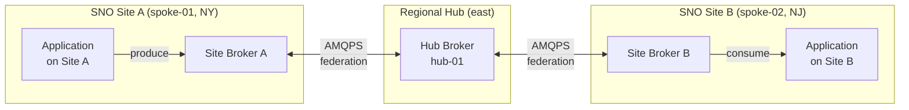

# Message Federation — Address Classes 5603-5607

AMQ Broker federation uses five address classes to control message routing
between site brokers (SNO) and regional hub brokers. Each class defines a
specific routing scope. Site brokers connect outbound to their regional
hub over AMQPS.

## Address Class Overview

## Message Flow by Address Class

```mermaid
sequenceDiagram
    participant AppA as App on Site A
    participant SiteA as Site Broker A (NY)
    participant Hub as Hub Broker (east)
    participant SiteB as Site Broker B (NJ)
    participant AppB as App on Site B

    Note over SiteA, Hub: All federation is AMQPS (outbound from site)

    rect rgb(60, 40, 40)
        Note right of AppA: Class 5603: Internal (site-local only)
        AppA->>SiteA: messages.NY.5603
        SiteA->>AppA: Consumed locally
        Note right of SiteA: Message stays on this SNO.<br/>Never leaves the site broker.
    end

    rect rgb(40, 40, 60)
        Note right of AppA: Class 5604: Site to hub only (maxHops=1)
        AppA->>SiteA: messages.NY.5604
        SiteA->>Hub: Federate (1 hop)
        Note right of Hub: Message reaches the regional hub.<br/>Does NOT forward to other sites.
    end

    rect rgb(40, 60, 40)
        Note right of AppA: Class 5605: Site to site via hub
        AppA->>SiteA: messages.NY.5605
        SiteA->>Hub: Federate
        Hub->>SiteB: Federate
        SiteB->>AppB: Deliver
        Note right of SiteB: Message routes through the hub<br/>to reach consumers on other sites.
    end

    rect rgb(60, 60, 40)
        Note right of Hub: Class 5606: Hub to all sites (broadcast)
        Hub->>Hub: messages.ALL.5606
        Hub->>SiteA: Federate to all
        Hub->>SiteB: Federate to all
        Note right of SiteB: Hub broadcasts to every site<br/>in the region.
    end

    rect rgb(60, 40, 60)
        Note right of Hub: Class 5607: Hub to one site (targeted)
        Hub->>Hub: messages.NY.5607
        Hub->>SiteA: Federate to NY only
        Note right of SiteA: Hub targets a specific site<br/>using the region prefix.
    end
```

## Address Class Reference

| Class | Address pattern | Scope | maxHops | Use case |
|-------|----------------|-------|---------|----------|
| **5603** | `messages.{REGION}.5603` | Site-local only | 0 | Internal processing. Must not leave the SNO. |
| **5604** | `messages.{REGION}.5604` | Site to regional hub | 1 | Telemetry, alerts, status reports from a site to the hub. |
| **5605** | `messages.{REGION}.5605` | Site to site via hub | 2 | Cross-site communication routed through the regional hub. |
| **5606** | `messages.ALL.5606` | Hub to all sites | 1 | Broadcast from the regional hub to every site in the region. |
| **5607** | `messages.{REGION}.5607` | Hub to one site | 1 | Targeted command from the hub to a specific site. |

## Key Points

- Applications choose the address class by topic name. The broker configuration handles routing.
- All federation connections are outbound from the site broker to the regional hub.
- `brokerProperties` secrets on each site configure federation connectors and address policies.
- In Mode 2, each region is independent. No cross-region federation exists in the first slice.
- Cookie-cutter broker configs mean all sites in a region share the same `brokerProperties` template.
