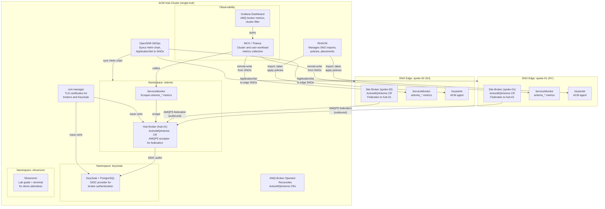

# Mode 1 Container Diagram (Single ACM Hub)

Mode 1 deploys one ACM hub cluster with all platform services. Students
provision SNO edge clusters in Module 2. Each SNO runs a site AMQ broker
that federates to the hub broker over AMQPS.

## Legend

| Component | Description |
|-----------|-------------|
| **Hub Broker (hub-01)** | Central AMQ Artemis broker. Accepts AMQPS federation from edge site brokers. |
| **Site Broker** | Edge AMQ Artemis broker on each SNO. Federates outbound to hub-01. |
| **RHACM** | Red Hat Advanced Cluster Management. Imports and manages SNO clusters. |
| **OpenShift GitOps** | Argo CD instance. Syncs the Helm chart on the hub and ApplicationSet to SNOs. |
| **Keycloak** | OIDC identity provider. Authenticates broker clients (admin, alice, bob). |
| **MCO / Thanos** | Monitoring stack. Collects metrics from hub and remote-writes from SNOs. |
| **Grafana** | AMQ dashboard ConfigMap. Shows broker metrics filtered by cluster. |
| **cert-manager** | Issues TLS certificates for broker AMQPS and Keycloak HTTPS. |
| **Showroom** | Lab guide application with embedded terminal for demo attendees. |

## Key Points

- All SNO connections are **outbound** from the edge to the hub.
- Federation uses AMQPS (TLS) on the hub broker acceptor.
- A single MCO/Thanos instance on the hub collects metrics from all clusters.
- Grafana filters by `cluster` label to distinguish `local-cluster` from `sno-edge-*`.
