# Mode 2 Container Diagram (Hub-of-Hubs)

Mode 2 deploys four clusters: one Global Hub (Tier 0) and three regional
ACM hubs (Tier 1: east, central, west). Students provision SNO edge sites
(Tier 2) onto a regional hub in Module 2. Each regional hub runs its own
AMQ hub broker. The Global Hub runs no AMQ broker.

```mermaid
flowchart TB
    subgraph T0 ["Tier 0: Global Hub"]
        GH["Multicluster Global Hub
        Inventory, policy replication,
        compliance Grafana (PostgreSQL)"]

        GHArgo["Argo CD
        Push config to
        3 regional hubs"]

        GHThanosQ["Thanos Query + Grafana
        Fleet AMQ metrics view
        (queries 3 regional stores)"]

        FleetApp["fleet-gitops Application
        hubs.yaml ApplicationSet"]
    end

    subgraph T1East ["Tier 1: Regional Hub East"]
        RHACM_E["RHACM
        Manages east SNOs"]

        ArgoE["Argo CD
        Pull ApplicationSet
        to east SNOs"]

        HubBrokerE["AMQ Hub Broker
        hub-01 east
        AMQPS acceptor"]

        MCOE["MCO / Thanos
        East regional metrics"]

        KeycloakE["Keycloak
        OIDC provider"]

        ShowroomE["Showroom
        Lab guide (east hub)"]
    end

    subgraph T1Central ["Tier 1: Regional Hub Central"]
        RHACM_C["RHACM
        Manages central SNOs"]

        ArgoC["Argo CD
        Pull ApplicationSet
        to central SNOs"]

        HubBrokerC["AMQ Hub Broker
        hub-01 central
        AMQPS acceptor"]

        MCOC["MCO / Thanos
        Central regional metrics"]

        KeycloakC["Keycloak
        OIDC provider"]
    end

    subgraph T1West ["Tier 1: Regional Hub West"]
        RHACM_W["RHACM
        Manages west SNOs"]

        ArgoW["Argo CD
        Pull ApplicationSet
        to west SNOs"]

        HubBrokerW["AMQ Hub Broker
        hub-01 west
        AMQPS acceptor"]

        MCOW["MCO / Thanos
        West regional metrics"]

        KeycloakW["Keycloak
        OIDC provider"]
    end

    subgraph T2East ["Tier 2: East SNOs"]
        SNO_E1["SNO east-01
        Site broker, klusterlet,
        User Workload Monitoring"]
        SNO_E2["SNO east-02
        Site broker, klusterlet,
        User Workload Monitoring"]
    end

    subgraph T2Central ["Tier 2: Central SNOs"]
        SNO_C1["SNO central-01
        Site broker, klusterlet"]
    end

    subgraph T2West ["Tier 2: West SNOs"]
        SNO_W1["SNO west-01
        Site broker, klusterlet"]
    end

    GHArgo -->|"push: fleet-gitops
    hubs/overlays/east"| ArgoE
    GHArgo -->|"push: fleet-gitops
    hubs/overlays/central"| ArgoC
    GHArgo -->|"push: fleet-gitops
    hubs/overlays/west"| ArgoW

    GH -.->|"GH agent
    (outbound from regionals)"| RHACM_E
    GH -.->|"GH agent"| RHACM_C
    GH -.->|"GH agent"| RHACM_W

    GHThanosQ -->|"gRPC store
    query"| MCOE
    GHThanosQ -->|"gRPC store
    query"| MCOC
    GHThanosQ -->|"gRPC store
    query"| MCOW

    ArgoE -->|"pull: fleet-gitops
    amq/overlays"| SNO_E1
    ArgoE -->|"pull"| SNO_E2
    ArgoC -->|"pull"| SNO_C1
    ArgoW -->|"pull"| SNO_W1

    RHACM_E -->|"manage"| SNO_E1
    RHACM_E -->|"manage"| SNO_E2
    RHACM_C -->|"manage"| SNO_C1
    RHACM_W -->|"manage"| SNO_W1

    SNO_E1 -->|"AMQPS federation"| HubBrokerE
    SNO_E2 -->|"AMQPS federation"| HubBrokerE
    SNO_C1 -->|"AMQPS federation"| HubBrokerC
    SNO_W1 -->|"AMQPS federation"| HubBrokerW
```

## Legend

| Tier | Cluster | Deployed by | Key services |
|------|---------|-------------|--------------|
| **0** | Global Hub | AgnosticD | Multicluster Global Hub, Argo CD (push), Thanos Query + Grafana (fleet AMQ) |
| **1** | Regional ACM hubs (x3) | AgnosticD | RHACM, Argo CD (pull), AMQ hub broker, Keycloak, MCO/Thanos, Showroom (east only) |
| **2** | SNO edge sites | Students (Module 2) | klusterlet, site AMQ broker, User Workload Monitoring |

## Key Points

- The Global Hub **never** runs an AMQ broker. Its Grafana shows compliance data (PostgreSQL-backed).
- Fleet AMQ metrics use a separate Thanos Query on the Global Hub that queries all three regional Thanos stores via gRPC passthrough.
- Each regional hub has its own MCO/Thanos instance. Regional Grafana sees only that region.
- GitOps push (Global to regionals) uses `fleet-gitops/applicationsets/hubs.yaml`. GitOps pull (regional to SNOs) uses `fleet-gitops/hubs/base/applicationset-amq.yaml`.
- Region Git tags (`fleet-east`, `fleet-central`, `fleet-west`) control the promotion boundary.
- SNO connections are outbound only. The regional hub never opens a connection to a site API.
- Showroom runs on the east regional hub only. Central and west hubs have no lab guide.
